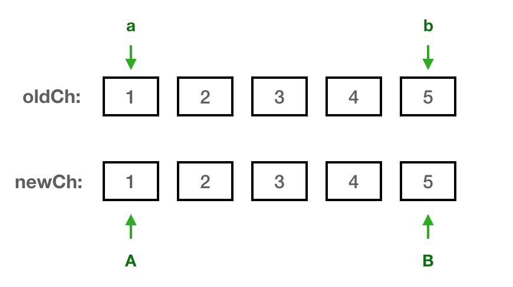

# Vue patch算法

Vue的differ`O(n)`是对传统differ`O(n^3)`的策略优化，只对同层级节点进行比较，其中patch部分包含了**属性更新、文本更新、子节点更新**，这里只要是**子节点更新**的实现

> 我手写了子节点更新的[算法](https://github.com/SevenGuns/patch/blob/66da73026545212e430a84ce9d6f5a048bd97733/example/vue.js#L5568)并附有详细的注释，`example`提供了可测试和断点调试的[代码](https://github.com/SevenGuns/patch/tree/master/example)


### 算法分析

假设有两个数组，一组代表老节点`oldCh`，一组代表新节点`newCh`



#### 两两比较运算

数组会创建4个游标，比较四个节点，找到**相同的**然后进行移动操作

```javascript
// 首先是以下四种情况：
if (sameVnode(oldStartVnode, newStartVnode)) {   // a == A 不用移动直接更新
  // 先执行节点属性更新
  patchVnode(oldStartVnode, newStartVnode);
  // 移动下标，往中间移动直到相交
  newStartVnode = newList[++newStartIdx];
  oldStartVnode = oldList[++oldStartIdx];
} else if (sameVnode(oldEndVnode, newEndVnode)) { // b == B 不用移动直接更新
  patchVnode(oldEndVnode, newEndVnode);
  newEndVnode = newList[--newEndIdx];
  oldEndVnode = oldList[--oldEndIdx];
} else if (sameVnode(oldStartVnode, newEndVnode)) { // a == B 首位移动到末位
  patchVnode(oldStartVnode, newEndVnode);
  // a移动到b后面
  nodeOps.insertBefore(
    parentElm,
    oldStartVnode.elm,
    nodeOps.nextSibling(oldEndVnode.elm)
  );
  // 继续移动新老下标
  oldStartVnode = oldList[++oldStartIdx];
  newEndVnode = newList[--newEndIdx];
} else if (sameVnode(oldEndVnode, newStartVnode)) { // b === A 末位移动到首位
  patchVnode(oldEndVnode, newStartVnode);
  // b移动到a前面
  nodeOps.insertBefore(parentElm, oldEndVnode.elm, oldStartVnode.elm);
	// 继续移动新老下标
  oldEndVnode = oldList[--oldEndIdx];
  newStartVnode = newList[++newStartIdx];
}
```


如果两两比较**没有相同**，如：`old: [4, 3]; new: [2, 5]`，则在`oldCh`种查找匹配`A`的节点，如果存在，则将该节点移动到`a`前面

> 如果节点有唯一key，查找的时间复杂度为O(n)，如果没有就是O(n ^ 2)

```javascript
const vnodeToMove = oldList[idxInOld];
// 后续循环时会过滤掉已移动的节点
oldList[idxInOld] = undefined;
nodeOps.insertBefore(parentElm, vnodeToMove.elm, oldStartVnode.elm);
```

如果不存在或存在但节点类型不同，则直接进行插入操作

```javascript
createElm(newStartVnode, [], parentElm, oldStartVnode.elm);
```

此时操作只需移动`A`

```javascript
newStartVnode = newList[++newStartIdx];
```


#### 循环体的设计

循环直至`a/b`或`A/b`相交

```javascript
while (newStartIdx <= newEndIdx && oldStartIdx <= oldEndIdx) {}
```


#### 循环结束的处理

循环结束后有两种情况需要处理：

- 老节点未遍历完，说明这些节点在新节点中不存在，直接删除
- 新节点未遍历完，说明这些节点都是新增节点，批量插入到`b/a`相交的位置

> b/a代表相交，b移动到a前面了

如果都遍历完就不用处理